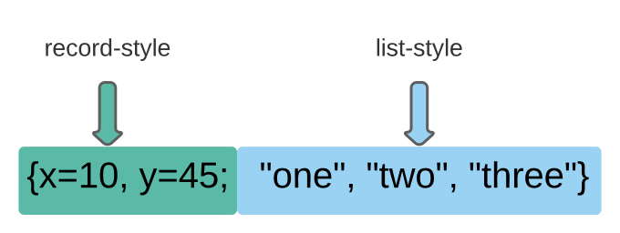

## Types and Values

1. number
2. string
3. nil
4. boolean
5. function
6. table
7. userdata
8. thread


- 返回a的类型 a:number

```lua
a=5
type(a) 
```

- type的返回类型为`string`,这与`a`没有任何关系

```lua
type(type(a))
```


**concept:**

- lua是一个动态类型语言
  - 没有类型定义
- 每个`value`携带自身的类型


==**Functions are first-class values in Lua**==

- 可以把`function`当作普通`value`一样操作

```lua
a=print
a(type(a))		--> function
```


#### **`nil`**

- 一个只有一个值的类型
- 一个全局变量在未初始化时的默认值
- 给已经有类型的全局变量指定其值为`nil`
  - 就是删除这个全局变量


#### **`booleans`**

- 这个类型有两个值
  - `true`
  - `false`
- `false`和`nil`在lua中代表**`false`**
- 除了上面这个外，其它值代表**`true`**
  - `0`、`""`都代表`true`


#### **`Numbers`**

- numbers是`double-precision floating-point`,没有`integer type`


#### **`Strings`**

- eight-bit
- 可以存储嵌入式零`'\0'`
  - c++中,字符串以`'\0'`结尾,不包括`'\0'`
- 可以存储任何的二进制数据
- `immutable values`(不可变)
- 对string的增删操作都会创建一个新的string

```lua
a="onestring"
b=string.gsub(a,"one","two")	-->change string parts
print(a)											-->onestring
print(b)											-->twostring
```

- strings可以包含下面的转义序列

  - | `\a` | bell                 |
    | ---- | -------------------- |
    | `\b` | back space           |
    | `\f` | form feed            |
    | `\n` | newline              |
    | `\r` | carriage return      |
    | `\t` | horizontal tab       |
    | `\v` | vertical tab         |
    | `\\` | backslash            |
    | `\"` | double quote         |
    | `\'` | single quote         |
    | `\[` | left square bracket  |
    | `\]` | right square bracket |

- 使用`[[ ]]`可以包含多行字符

- 对任何`string`类型进行数学操作(`numeric`),lua都尝试将其转换为`number`

  - ```lua
    print("10"+1)		-->11
    print("10 + 1")	-->11
    print("hello"+1)-->error(cannot convert "hello")
    ```

- 当数字遇到`..`时,lua会将其转换为`string`
  
  - `..`:string concatenation operator(字符串串联操作)

```lua
print(10 .. 20)		-->1020
```

灰色区域必须有一个`space`空格,lua会把数字后面的`.`当作小数点		


- 使用`tonumber()`显式的转换一个数字字符串到数字

  ```lua
  tonumber("10")		-->10
  ```

- 把number转换成string

  1. 使用`tostring()`

  2. 数字串联一个空字符串

  ```lua
  tostring(10)	-->"10"
  10 .. ""			-->"10"
  ```


- 获取字符串长度 s:4

```lua
s="clua"
print(#s)
```

- 多行打印字符串 

```lua
s="clua\ncplusplus"
print(s)
--clua
--cplusplua
```
```lua
s=[[clua
    cplusplua
  ]]
print(s)
--clua
--cplusplus
```

- 字符串拼接
  - %d: 与数字拼接
  - %s: 与字符拼接

```lua
s="clua"
t="cplus"
print(s..t)
--cluacplus
```
```lua
s="clua"
print(string.format("cue %s",s))
--cue clua
```

- 其它类型转字符串

```lua
b=true
tostring(b)
-- true
print(type(tostring(b)))
--string
```

- 小写转大写(返回新的字符串(不会影响原来字符串))

```lua
s="clua"
string.upper(s)
```

- 大写转小写(返回新的字符串(不会影响原来字符串))

```lua
s="CLUA"
string.lower(s)
--clua
```

- 翻转字符串

```lua
s="clua"
print(string.reverse(s))
--aulc
```

- 字符串查找(lua开始是从1开始)

```lua
s="cluahelloworld"
print(string.find(s,"llo"))
--7  9
```

- 字符串截取

```lua
s="cluahelloworld"
print(string.sub(s,5))
--helloworld

print(string.sub(s,5,7))
--hel
```

- 字符串重复(第二个数字是重复次数)

```lua
s="cluahelloworld"
print(string.rep(s,2))
--cluahelloworldcluahelloworld
```

- 字符串修改(返回修改后字符串以及字符串对应字符被修改次数)

```lua
s="cluahelloworld"
print(string.gsub(s,"l","*"))
--c*uahe**owor*d	4
```

- 把指定位置的字符转为ASCII码

```lua
s="cluahelloworld"
print(string.byte(s,4))
--97
```

- 把ASCII转为字符

```lua
s="cluahelloworld"
ascii=string.byte(s,4)
str=string.char(ascii)
print(str)
--a
```


#### **`Tables`**

**concept:**

- 实现关联数组(array)
- index可以是==lua==语言的任何`value`类型
  - 必须是可以判断出来的类型
    - `type(index)`输出是`index`支持的类型
- index不包括`nil`
- 没有固定大小,是动态的
- `tables`既不是`values`也不是`variables`,是**`objects`**
- 对`table`的操控实际是操控它的引用(==reference==)
- `table`不会存在隐藏的`copies`(副本)或者在后台创建新的tables

```lua
a = {}     -- create a table and store its reference in `a'
```

**multi reference a table**

```lua
a = {}
a["x"] = 10
b = a      -- `b' refers to the same table as `a'
print(b["x"])  --> 10
b["x"] = 20
print(a["x"])  --> 20
a = nil    -- now only `b' still refers to the table
b = nil    -- now there are no references left to the table
```

**To represent records(描述记录)**

```lua
a.x = 10                    -- same as a["x"] = 10
print(a.x)                  -- same as print(a["x"])
print(a.y)                  -- same as print(a["y"])
```

**`table`中不同的`value`占用不同的位置(position)**

```lua
i=10
j="10"
k="+10"									-->i,j,k三个是不同的value,占用不同的位置
a={}
a[i]="one"
a[j]="two"
a[k]="three"
print(a[i])							-->"one"
print(a[j])							-->"two"
  print(a[k])						-->"three"

print(a[tonumber(j)])		-->"one"
print(a[tonumber(k)])		-->"one"
```


#### **`function`**

**concept:**

1. **first-class values**
   1. 可以存储在一个变量里
      1. 作为参数传递给其它function
      2. 作为结果返回


- 可变参数

  ```lua
  function foo( ... )
  	for k,v in pairs({...}) do
  		print(k,v)
  	end
  end
  --********************两种写法都可以**********************
  function foo( ... )
  	for k,v in pairs(...) do
  		print(k,v)
  	end
  end
  
  foo({"github","bitbucket","gitlab",nil,"git"})
  --[[
  1	github
  2	bitbucket
  3	gitlab
  5	git
  n	5 --table长度
  ]]
  ```

  - 使用`select`输出`nil`
    - `select('#',...)`table长度

  ```lua
  function foobar( ... )
  	for i=1,select('#',...) do
  		num=select(i,...)
  		print(i,num)
  	end
  end
  
  foobar("github","bitbucket","gitlab",nil,"git")
  --[[
  1	github
  2	bitbucket
  3	gitlab
  4	nil --nil输出了
  5	git
  ]]--
  ```

  - `select(i,...)`输出

  ```lua
  function foobar( ... )
  	for i=1,select('#',...) do
  		--num=select(i,...) --i表示从哪里开始输出
  		--print(i,num)
  		print(select(i,...))
  	end
  end
  
  foobar("github","bitbucket","gitlab",nil,"git")
  
  --[[
  github	bitbucket	gitlab	nil	git
  bitbucket	gitlab	nil	git
  gitlab	nil	git
  nil	git
  git
  ]]
  ```

  - `select(1,...)`输出

  ```lua
  function foobar( ... )
  	for i=1,select('#',...) do
  		--num=select(i,...)
  		--print(i,num)
  		print(select(1,...))
  	end
  end
  
  foobar("github","bitbucket","gitlab",nil,"git")
  
  --[[
  github	bitbucket	gitlab	nil	git
  github	bitbucket	gitlab	nil	git
  github	bitbucket	gitlab	nil	git
  github	bitbucket	gitlab	nil	git
  github	bitbucket	gitlab	nil	git
  ]]
  ```


#### **`Userdata and Threads`**

1. **Userdata**
   1. 允许任何的`C data`存储在`lua variables`
   2. lua里没有`predefined operations`(预定义操作)

**Userdata concept:**

1. 通过lua程序创建的新类型
2. 使用`C`语言写的库

## real random

```lua
function real_random(min,max)
	local str_time = tostring(os.time()) --1600872569(以秒更新)
	local str_rev = string.reverse(str_time) --翻转值(使得其变化大)
	local str_sub = string.sub(str_rev,1,6) --六位数足够(也可以不截断)
	math.randomseed(str_sub)
	print(math.random(min,max))
end

real_random(1,100)
```


## Expressions

1. numeric constants(数字常量)
2. string literals(字符串字面值)
3. variables
4. unary operation(一元的)
5. binary operation(二元的)
6. function calls
7. unconventional function(非传统)
8. table constructors


**`Arithmetic Operators`**

包含在`lua core`里面的算术操作

1. binary operators
   1. '+' (addition)
   2. '-' (subtraction)
   3. '*' (multiplication)
   4. '/' (division)
2. unary operators
   1. '-' (negation)

lua也支持`'^'`,但是lua在lua core中只提供对应的语法,实际计算是调用`standard library`中的`C mathematical library`


**`Relational Operators`**

1. `>`
2. <
3. <=
4. `>=`
5. ==
6. ~=

**`nil`**仅仅与自身相等

- 通过`reference`来比较:
  1. tables
  2. userdata
  3. functions

- `string`通过==alphabetical order==(字母顺序)来进行比较两个字符串


**`Logical Operators`**

1. and
2. or 
3. not

- ==`and`的优先级要高于`or`==

- `and`、`or`使用short-cut evaluation(捷径评估)
  1. `and`: 第一个参数是`false`,就返回第一个参数
  2. `or`: 第一个参数是`true`,就返回第一个参数

**a ? b : c == (b>c)  and  b  or  c**


**`Precedence`**(优先级)

| highter |                                |
| ------- | ------------------------------ |
|         | ^                              |
|         | not   - (unary)                |
|         | *     /                        |
|         | +    -                         |
|         | ..                             |
|         | <    >    <=    >=    ~=    == |
|         | and                            |
| lower   | or                             |

- 所有==binary operators==是左关联的
- `'^'`和`..`是右关联

```lua
a+i < b/2+1          <-->       (a+i) < ((b/2)+1)
5+x^2*8              <-->       5+((x^2)*8)
a < y and y <= z     <-->       (a < y) and (y <= z)
-x^2                 <-->       -(x^2)
x^y^z                <-->       x^(y^z)
```


**`Table Constructors`**

*`Constructors`*是一个==expressions==,创建和初始化`tables`

`linked lists`:

1. 使用table创建和初始化链表

```lua
list = nil
for line in io.lines() do
  list = {next=list, value=line}
end
```

2. 打印链表

```lua
l = list
while l do
  print(l.value)
  l = l.next
end
```

*自定义index*

```lua
opnames = {["+"] = "add", ["-"] = "sub",
           ["*"] = "mul", ["/"] = "div"}

i = 20; s = "-"
a = {[i+0] = s, [i+1] = s..s, [i+2] = s..s..s}

print(opnames[s])    --> sub
print(a[22])         --> ---
```

*让index从`0`开始*(不推荐)

```lua
days = {[0]="Sunday", "Monday", "Tuesday", "Wednesday",
            "Thursday", "Friday", "Saturday"}
```

*使用`;`分隔record部分和list部分*




## Statements

#### Assignment(分配)

- lua会把所有的值计算完,再进行分配

```lua
x, y = y, x                -- swap `x' for `y'
a[i], a[j] = a[j], a[i]    -- swap `a[i]' for `a[j]'
```


#### Local  Variables and  Blocks

- 接收==local variables==比==global variables==更快
- 使用==do-end==来定义一个block

```lua
x=23
do	
	local x = 1
	if x>20 then	
		x=x+1
		print(x)
	else
		x=x+10
		print(x)		-->11 (local)
	end
end
print(x)		-->23 (global)
```


#### Control Structures

- **end** terminates(终止) the **if**, **for** and **while** structures
- **until** terminates the **repeat** structure

```lua
if  then	end

while	 do	 end

x=1
repeat
	x=x+1
until x>5
print(x)	-->6
```

##### Numeric  for

- Numeric **`for`**
- 输出`exp1`到`exp2`的值
  - 增量为`exp3`
    - 省略的话,默认是(exp3=1)
  - exp1,exp2,exp3仅仅计算一次值,计算发生在`for`开始之前
- 使用`break`终止循环
  - 可以输出table中所有值,包括`nil`

```lua
for var=exp1,exp2,exp3 do
  something
end


for i=1,10,2 do
  print(i)
end
--[[
1
3
5
7
9
]]


function foo( ... )
	local t = table.pack(...)	
	for i=1,t.n do
		print(i,t[i])
	end
end

foo("github","bitbucket","gitlab",nil,"git",nil)
--[[
1	github
2	bitbucket
3	gitlab
4	nil
5	git
6	nil
]]
```

##### Generic  for

-  Generic **for**
   -  `ipairs`
      -  遇到`nil`就结束
   -  `pairs`
      -  遇到`nil`不输出

```lua
for i,v in ipairs(table_name) do
	print(i,v)
end


for k,v in pairs(table_name) do
	print(k,v)
end
```

-  **break** and **return**

- `break`
  - 结束`**for**, **repeat**, or **while`**
- `return`
  - 返回一个临时结果
  - 结束一个function
  - 每个function都有一个隐含的`return`

测试时仅仅用来结束function

```lua
function foo()
	local x = 1
	print(x)
	--return		-->语义错误
  do return end		-->正确
	x=x+10
	print(x)		-->已经return,所以这里不输出
end
foo()
-- 1
```


## Functions

**`functions`是对`statements`和`expressions`抽象的主要机制**

下面这些情况等价:

```lua
print "Hello World"     <-->     print("Hello World")
dofile 'a.lua'          <-->     dofile ('a.lua')
print [[a multi-line    <-->     print([[a multi-line
 message]]                        message]])
f{x=10, y=20}           <-->     f({x=10, y=20})
type{}                  <-->     type({})
```

使用functions进行object-oriented programming

```lua
o.foo(o,x)		<-->		o:foo(x)
```

**`parameters  and  arguments`**

- 额外的`parameters`,赋给`nil`
- 额外的`arguments`,丢弃

```lua
function f(a, b) return a or b end		-->这里的a,b是parameters
print (f(3))		--a=3,b=nil						-->这里的`3`是argument
-- 3
print(f(3,4))
-- 3
print(f(3,4,5)) --a=3,b=4	 (5 is discarded)
-- 3
```

```lua
function incCount (n)
  n = n or 1
  count = count + n
end
incCount()	-->n被初始化为`nil`
```

#### Multiple Results

```lua
function foo () 		end                  -- returns no results
function bar () 		return 'a' end       -- returns 1 result
function foobar ()  return 'a','b' end   -- returns 2 results
```

1. 多重赋值中,function调用被放在最后,会输出与接收变量同样多的结果

```lua
x,y = foobar()        -- x='a', y='b'
x = foobar()          -- x='a', 'b' is discarded
x,y,z = 10,foobar()   -- x=10, y='a', z='b'
```

2. function调用不是放在最后,function总是只有一个返回值

```lua
x,y = foobar(), 20      -- x='a', y=20
x,y = foo(), 20, 30  -- x=nil, y=20, 30 is discarded
print(foobar().."foobar")
-- afoobar

a = {foo(), foobar(), 4}   -- a[1] = nil, a[2] = 'a', a[3] = 4

print(foobar(),55)
-- a	55
```

3. 

```lua
a = {foo()}         -- a = {}  (an empty table)
a = {bar()}         -- a = {'a'}
a = {foobar()}         -- a = {'a', 'b'}
```

4. 使用`()`强制返回一个结果

```lua
print((foo()))           --> nil
print((bar()))        	 --> a
print((foobar()))        --> a
```

#### Variadic Functions(可变参数函数)

- `table.pack()`
  - 接收`...`的所有参数,并且返回一个新的table
  - 自带一个`n`,返回table中所有元素的数量(包括`nil`)

```lua
function foo( ... )
	local x = table.pack(...)	
	for i=1,x.n do
		print(i,x[i])
	end
end

foo("github","bitbucket","gitlab",nil,"git",nil)
--[[
1	github
2	bitbucket
3	gitlab
4	nil
5	git
6	nil
]]
```


6. `select(selector,...)`
   - 输出从`selector`开始的参数
   - `"#"`输出参数数量
   - 不需要创建新的table

```lua
print(select(1,"a","b","c"))
-- a b c

print(select(2,"a","b","c"))
-- b c

print(select("#","a","b","c"))
-- 3
```

```lua
print(select("1","github","bitbucket","gitlab",nil,"git",nil))
-- github	bitbucket	gitlab	nil	git	nil
--************************************************
function add( ... )
	local sum = 0
	for i=1,select("#",...) do
		sum=sum+select(i,...)
	end
	return sum
end
print(add(3,6,4,2,7,9))
-- 31
--***************************************
function foo( ... )	
	local x = 0
	for i=1,select("#",...) do
		x=select(i,...)		--'x'只能接收一个返回值
		print(x)
	end		
end

foo(3,6,4,2,7,9))
--[[
3
6
4
2
7
9
]]
```

#### `table.unpack()`

```lua
t={"github","bitbucket","gitlab",nil,"git",nil}

print(table.unpack(t,1,2))
-- github bitbucket

print(table.unpack(t,2,2))
-- bitbucket
```

#### Proper Tail Calls(正确尾调用)

==Proper Tail Calls == Proper Tail recursion==

**concept:**

- 一个函数最后一个动作是调用其它函数时,发生尾调用
  - `bar()`执行完之后不需要返回到`foo()`函数这里
    - 所以`foo()`不需要在stack(栈)上保存`bar()`函数的任何信息

```lua
function foo()
  return bar()
end 
```

**advantages:**

-  不占用==堆栈==空间,所以没有==栈溢出==,可以优化存储空间
-  可以不限制的嵌套尾调用
   - 类似于递归(recursion)

**不是尾调用**

```lua
return g(x) + 1     -- must do the addition
return x or g(x)    -- must adjust to 1 result
return (g(x))       -- must adjust to 1 result
```

**是尾调用**

```lua
return x[i].foo(x[j] + a*b, i + j)
--bar()=x[i].foo(x[j] + a*b, i + j)
```

- `bar()`的参数构成是一个复杂的表达式
  - lua解释器会提前评估(计算)
    - 所以最后一个动作仍然是`call`一个函数


**尾调用的应用:**

- ==data-driven==(数据驱动)的==state-machine==

```lua
function room1 ()
      local move = io.read()
      if move == "south" then return room3()
      elseif move == "east" then return room2()
      else print("invalid move")
           return room1()   -- stay in the same room
      end
    end
    
    function room2 ()
      local move = io.read()
      if move == "south" then return room4()
      elseif move == "west" then return room1()
      else print("invalid move")
           return room2()
      end
    end
    
    function room3 ()
      local move = io.read()
      if move == "north" then return room1()
      elseif move == "east" then return room4()
      else print("invalid move")
           return room3()
      end
    end
    
    function room4 ()
      print("congratulations!")
    end
--We start the game with a call to the initial room:
    room1()
```

- Write  a  function  that  takes  an  arbitrary(任意)  number  of  values  and  returns  all  of  them,  except the first one

```lua
function foobar( ... )
	return select(2,...)
end

print(foobar(1,2,nil,4,5,6,nil))
-- 2	nil	4	5	6	nil
```

-  Write  a  function  that  takes  an  arbitrary  number  of  values  and  returns  all  of  them,  except the last one.

```lua
function bar( ... )
	return table.unpack({...},1,select("#",...)-1)
end
print(bar(1,2,nil,4,5,nil,7))
-- 1	2	nil	4	5	nil
```


## The External World

#### The Simple I/O Model

`io.read()`的读取模式:

| "a"  | reads the whole file                       |
| ---- | ------------------------------------------ |
| "l"  | reads the next line (dropping the newline) |
| "L"  | reads the next line (keeping the newline)  |
| "n"  | reads a number                             |
| num  | reads num characters as a string           |

`io.input(filename) ` 

- 使得文件状态成为一个输入流
- 此时文件处在`read()`模式下(*current input stream*)
  - 使用`io.read()`读取文件内容
  - `io.close(filename)`关闭文件I/O流

## operator


- lua自行推断,如果可以转成数字,会转成数字进行加法运算
```lua
print("234.5"+3)
--237.5
```

- 支持"短路"(根据and, 前面为true则直接判断后面;或者前面为false直接返回false)

```lua
print(true and print("123"))
--123
--nil
print(false and print("123"))
--false
```

- lua不支持函数重载(调用的是foo(a)这个函数)
  - 默认调用离调用最近的函数

```lua
function foo()
	print("foo")
end

function foo(a)
	print(a)
end
foo()
--nil
```


- 函数嵌套

```lua
--函数是一个变量类型
function foo()
	function bar()
		print("函数嵌套")
	end
	return bar
end

f=foo()
f()
--函数嵌套
```


- 函数闭包(延迟传入参数的生命周期)

```lua
--函数闭包
function foo(x)
	return function (y)
		return x+y
	end
end

f=foo(3)--这条语句执行完x参数生命周期结束
g=f(4)--因为这里用到了x参数，所以延长了x参数的生命周期
print(g)
--7
```

- 自定义索引不连续情况遍历方式不同结果不同

```lua
t={[1]=1,[2]=2,[4]=4,[6]=6}
for i=1,#t do --#t=6
	print(t[i])
end
--[[
1
2
nil
4
nil
6
]]
for i,v in ipairs(t) do
	print(i,v)
end
--[[遇到nil不再输出
1	1
2	2
]]
for k,v in pairs(t) do
	print(k,v)
end
--[[
1	1
2	2
4	4
6	6
]]
```


- table.insert

```lua
t1={{age=15,name="foo"},{age=18,name="bar"}}
t2={age=23,name="bug"}

table.insert(t1,t2) --t2表插入到t1
```

- table.sort

```lua
t={2,8,4,7,1,9,5}
table.sort(t) --默认升序排序
-- 1 2 4 5 7 8 9
```

- table.sort

```lua
t={2,8,4,7,1,9,5}
table.sort(t,function(a,b)
              if a > b then
                  return true
              end
          end) --降序排序
-- 9 8 7 5 4 2 1 
```

## globle local

- 没有local限定的是全局变量
- 有local限定的是本地变量
- 使用`_G`表可以查找所有声明的全局变量


## metatable
#### concept(概念)
1. 元表是用来对两个表进行相关操作(__add,__sub,__mul,__div,__mod,__pow...)(相当于运算符重载效果)
2. 任何表都可以关联一个元表
3. 所有这些元方法(元操作)都是声明在元表中

#### setmetatable  getmetatable
- setmetatable(table,metatable)
  - 在metatable中有__metatable键值(关键字),这个设置失败
- getmetatable(table)
  - 返回table的metatable

#### __tostring

```lua
meta={
	__tostring=function (t)
		return t.name		
	end
}

t={
	name="yet"
}

setmetatable(t,meta)
print(t)
--yet --当table被当作string使用时,会默认调用对应metatable的__tostring方法(__tostring是默认且固定的)
```

#### __call


```lua
meta={
	__tostring=function (t)
		return t.name		
	end,

	__call=function (n,s)
		print(n)
		print(s)
		print("__call")
	end
}

t={
	name="yet",
	age=18,
	sex="man"
}

setmetatable(t,meta)
t("bug") --table以函数方式调用(默认调用对应metatable里面的__call方法)
--[[
yet --默认调用第一个参数
bug --参入参数
__call
]]
```

#### meta function

```lua
meta={
	__add=function (t1,t2)
		return t1.age+t2.age
	end,
	__sub=function (t1,t2 )
		return t1.age-t2.age
	end,

	__eq=function (t1,t2)
		return t1.age==t2.age
	end
	-- __mul
	-- __div
	-- __pow(^)
	-- __mod(%)
	-- __eq(==)
	-- __lt(<)
	-- __le(<=)
	-- __concat(..)
}

t={
	age=18
}
setmetatable(t,meta)

t2={
	age=18
}

print(t+t2)
--40 
print(t-t2)

print(t==t)
--true --元表一致时,table里面的元素才可以正确比较
print(t==t2)
--false --元表不一致,比较不准确
```


#### __index,__newindex

```lua
meta={
	age=18	
}
t2={
	age=44
}

t={
	--age=22
}

setmetatable(t,meta)

meta.__index=meta
print(t.age)
--18 --首先查找t表里的age,没有就到元表里查找__index指定的表

meta.__index=t2
print(t.age)
--44 --可以指定任意表

meta={}
meta.__newindex={}
t={}
setmetatable(t,meta)
t.age=18 --age在表中不存在
print(meta.__newindex.age)
--18
--赋值时，如果赋值给一个不存在的索引
--会把这个值赋值到newindex所指的表中，不会修改自己
print(rawget(t,"age")) --仅仅查找t表里的age索引
--nil --t表里没有age,这个age被放到了__newindex指定表里
rawset(t,"name","foo") --仅仅会在t表里设置key和value,不受__newindex影响
print(t.name)
--foo
```


**`(bar())`**

- 只输出一个结果

```lua
function foo()
	return (bar())
end

function bar()
	return 100,200,300
end

print(foo())
-- 100
```


## Closures(闭包)

**无参数闭包**

```lua
function foo()	
	local x = 0	--x为"非局部"变量,称为"upValue"
	return function ()		
		x=x+1
		return x
	end
end

f=foo()
res=f()
print(res)
-- 1
res=f()
print(res)
-- 2
res=f()
print(res)
-- 3
res=f()
print(res)
-- 4
```

**有参数闭包**

```lua
function foo(x)
	return function ()
		x=x+1
		return x
	end
end

f=foo(10)

res=f()
print(res)
-- 11
res=f()
print(res)
-- 12
res=f()
print(res)
-- 13
res=f()
print(res)
-- 14
```

**多内嵌函数闭包**

- 嵌套函数之间共享数据

```lua
function foo()
	local x = 22 --数据共享

	function inner_first() --负责输出
		print(x)
	end

	function inner_second() --负责计算
		x=x+100
	end

	return inner_first,inner_second
end

local inner_first,inner_second = foo()
inner_first()
inner_second()
inner_first()
```

**闭包的状态保存**

```lua
function foo(x)
	return function (y)
		return x*y --这里x不能保存状态
	end
end
f=foo(10)
res=f(2)
print(res)
-- 20
res=f(2)
print(res)
-- 20

-- ***********************************************

function foo(x)
	return function (y)
		x=x*y	--这里x保存了状态
		return x 
	end
end
f=foo(11)
res=f(2)
print(res)
-- 22
res=f(2)
print(res)
-- 44
```

